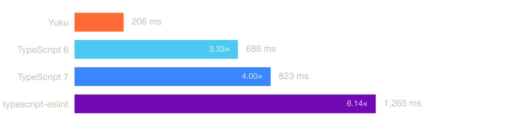
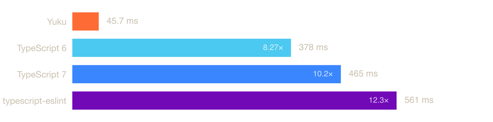
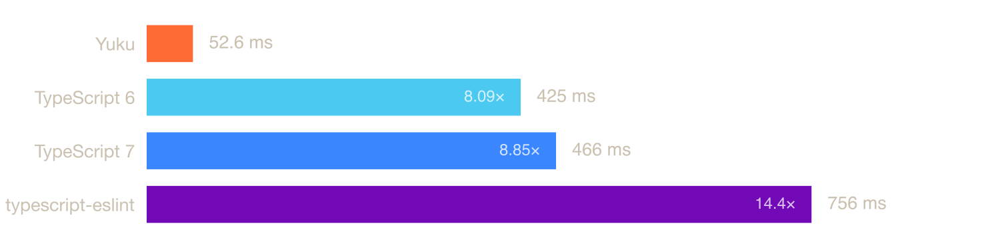
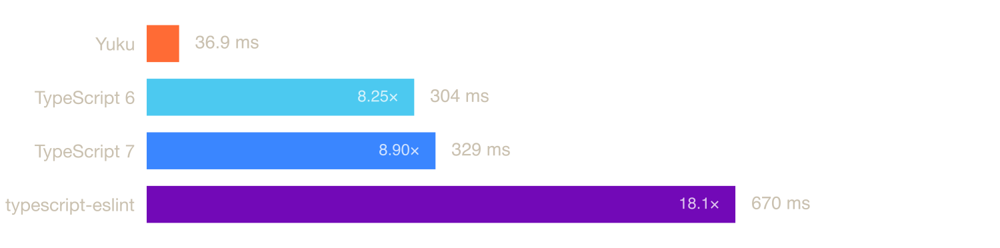
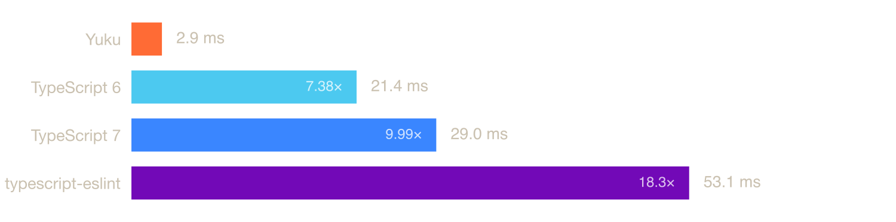
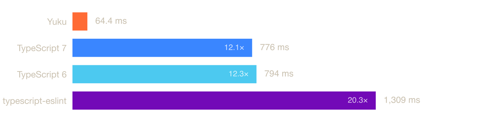
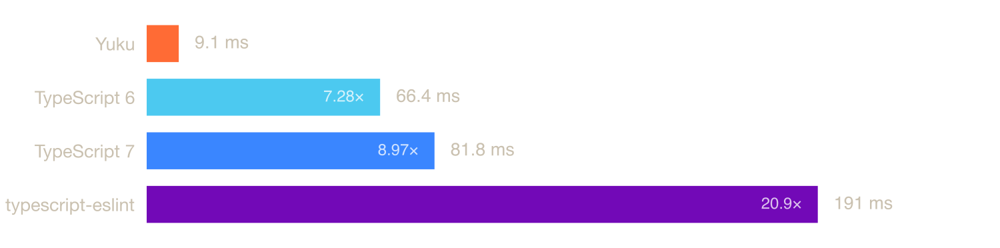
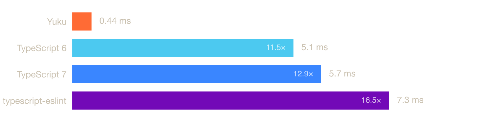

# ECMAScript Analyzer Benchmark (npm)

How fast the JavaScript and TypeScript analyzers on npm build the semantic model of real codebases: every scope and binding, every reference resolved to its declaration, and every import linked across files.

## Summary

Median time to analyze a whole codebase. The fastest in each row is bold, and every other time shows how many times it is of the fastest.

| | Files | Yuku | TypeScript 7 | TypeScript 6 | typescript-eslint |
|---|---:|---|---|---|---|
| [TypeScript compiler](#typescript-compiler) | 77 | **206 ms** | 823 ms · 4.00× | 686 ms · 3.33× | 1,265 ms · 6.14× |
| [Excalidraw](#excalidraw) | 618 | **82.9 ms** | 683 ms · 8.24× | 598 ms · 7.21× | 1,064 ms · 12.8× |
| [three.js](#threejs) | 755 | **45.7 ms** | 465 ms · 10.2× | 378 ms · 8.27× | 561 ms · 12.3× |
| [Vue](#vue) | 473 | **52.6 ms** | 466 ms · 8.85× | 425 ms · 8.09× | 756 ms · 14.4× |
| [Zod](#zod) | 332 | **36.9 ms** | 329 ms · 8.90× | 304 ms · 8.25× | 670 ms · 18.1× |
| [date-fns](#date-fns) | 1,643 | **48.7 ms** | 438 ms · 8.99× | 254 ms · 5.21× | 410 ms · 8.42× |
| [Svelte](#svelte) | 416 | **25.2 ms** | 283 ms · 11.2× | 219 ms · 8.69× | 307 ms · 12.2× |
| [Preact](#preact) | 33 | **2.9 ms** | 29.0 ms · 9.99× | 21.4 ms · 7.38× | 53.1 ms · 18.3× |

On single files:

| | Files | Yuku | TypeScript 7 | TypeScript 6 | typescript-eslint |
|---|---:|---|---|---|---|
| [typescript.js](#typescriptjs) | 1 | **64.4 ms** | 776 ms · 12.1× | 794 ms · 12.3× | 1,309 ms · 20.3× |
| [checker.ts](#checkerts) | 1 | **37.2 ms** | 275 ms · 7.40× | 238 ms · 6.40× | 433 ms · 11.6× |
| [lib.dom.d.ts](#libdomdts) | 1 | **9.1 ms** | 81.8 ms · 8.97× | 66.4 ms · 7.28× | 191 ms · 20.9× |
| [react.js](#reactjs) | 1 | **0.44 ms** | 5.7 ms · 12.9× | 5.1 ms · 11.5× | 7.3 ms · 16.5× |

## Projects

### [TypeScript compiler](https://github.com/microsoft/TypeScript/tree/050880ce59e30b356b686bd3144efe24f875ebc8)

77 files · 9.0 MB · TypeScript



| Analyzer | Median | RME | Min | Max | Relative |
|----------|--------|-----|-----|-----|----------|
| **Yuku** | **206 ms** | **±0.41%** | **201 ms** | **220 ms** | **baseline** |
| TypeScript 6 | 686 ms | ±0.64% | 671 ms | 799 ms | 3.33× slower |
| TypeScript 7 | 823 ms | ±0.28% | 810 ms | 866 ms | 4.00× slower |
| typescript-eslint | 1,265 ms | ±0.63% | 1,224 ms | 1,356 ms | 6.14× slower |

### [Excalidraw](https://github.com/excalidraw/excalidraw/tree/1919728724a1b71af73cb7e6d2d1a418a1415b1c)

618 files · 7.6 MB · declarations, JavaScript, TypeScript, TSX


| Analyzer | Median | RME | Min | Max | Relative |
|----------|--------|-----|-----|-----|----------|
| **Yuku** | **82.9 ms** | **±0.47%** | **81.8 ms** | **93.0 ms** | **baseline** |
| TypeScript 6 | 598 ms | ±0.27% | 591 ms | 621 ms | 7.21× slower |
| TypeScript 7 | 683 ms | ±0.33% | 668 ms | 712 ms | 8.24× slower |
| typescript-eslint | 1,064 ms | ±0.60% | 1,047 ms | 1,163 ms | 12.8× slower |

### [three.js](https://github.com/mrdoob/three.js/tree/157f0885b8428b5ffe8f6f7309b2d6f59faa1497)

755 files · 4.4 MB · JavaScript



| Analyzer | Median | RME | Min | Max | Relative |
|----------|--------|-----|-----|-----|----------|
| **Yuku** | **45.7 ms** | **±0.61%** | **43.8 ms** | **50.1 ms** | **baseline** |
| TypeScript 6 | 378 ms | ±0.55% | 369 ms | 413 ms | 8.27× slower |
| TypeScript 7 | 465 ms | ±0.43% | 450 ms | 491 ms | 10.2× slower |
| typescript-eslint | 561 ms | ±0.50% | 549 ms | 602 ms | 12.3× slower |

### [Vue](https://github.com/vuejs/core/tree/4ab865a848a1da3d10fb674f857e5fff13094644)

473 files · 4.1 MB · declarations, JavaScript, TypeScript



| Analyzer | Median | RME | Min | Max | Relative |
|----------|--------|-----|-----|-----|----------|
| **Yuku** | **52.6 ms** | **±0.37%** | **51.0 ms** | **54.4 ms** | **baseline** |
| TypeScript 6 | 425 ms | ±1.60% | 408 ms | 565 ms | 8.09× slower |
| TypeScript 7 | 466 ms | ±0.46% | 446 ms | 484 ms | 8.85× slower |
| typescript-eslint | 756 ms | ±1.15% | 727 ms | 870 ms | 14.4× slower |

### [Zod](https://github.com/colinhacks/zod/tree/004d800c9e3cd4c79930f55aa4ad080225b22efd)

332 files · 2.9 MB · TypeScript



| Analyzer | Median | RME | Min | Max | Relative |
|----------|--------|-----|-----|-----|----------|
| **Yuku** | **36.9 ms** | **±0.91%** | **35.7 ms** | **41.7 ms** | **baseline** |
| TypeScript 6 | 304 ms | ±1.91% | 292 ms | 435 ms | 8.25× slower |
| TypeScript 7 | 329 ms | ±2.06% | 307 ms | 439 ms | 8.90× slower |
| typescript-eslint | 670 ms | ±1.74% | 620 ms | 823 ms | 18.1× slower |

### [date-fns](https://github.com/date-fns/date-fns/tree/717ce0a807ea4c6b540d015b5c408723175b2838)

1,643 files · 2.8 MB · declarations, JavaScript, TypeScript


| Analyzer | Median | RME | Min | Max | Relative |
|----------|--------|-----|-----|-----|----------|
| **Yuku** | **48.7 ms** | **±2.77%** | **44.3 ms** | **73.3 ms** | **baseline** |
| TypeScript 6 | 254 ms | ±0.66% | 248 ms | 281 ms | 5.21× slower |
| typescript-eslint | 410 ms | ±0.71% | 401 ms | 442 ms | 8.42× slower |
| TypeScript 7 | 438 ms | ±0.98% | 414 ms | 522 ms | 8.99× slower |

### [Svelte](https://github.com/sveltejs/svelte/tree/020242d6bef059df9ae8c13dc8dbff4c9b31e0ff)

416 files · 1.9 MB · declarations, JavaScript, TypeScript


| Analyzer | Median | RME | Min | Max | Relative |
|----------|--------|-----|-----|-----|----------|
| **Yuku** | **25.2 ms** | **±0.76%** | **24.7 ms** | **27.7 ms** | **baseline** |
| TypeScript 6 | 219 ms | ±0.79% | 210 ms | 236 ms | 8.69× slower |
| TypeScript 7 | 283 ms | ±0.44% | 276 ms | 299 ms | 11.2× slower |
| typescript-eslint | 307 ms | ±0.69% | 298 ms | 335 ms | 12.2× slower |

### [Preact](https://github.com/preactjs/preact/tree/3fcc391adc243d479ab10b4cf70fa609708c9348)

33 files · 0.3 MB · declarations, JavaScript



| Analyzer | Median | RME | Min | Max | Relative |
|----------|--------|-----|-----|-----|----------|
| **Yuku** | **2.9 ms** | **±1.89%** | **2.7 ms** | **4.2 ms** | **baseline** |
| TypeScript 6 | 21.4 ms | ±4.06% | 20.3 ms | 37.7 ms | 7.38× slower |
| TypeScript 7 | 29.0 ms | ±0.83% | 27.4 ms | 32.3 ms | 9.99× slower |
| typescript-eslint | 53.1 ms | ±1.37% | 47.4 ms | 62.5 ms | 18.3× slower |

## Single files

### [typescript.js](https://raw.githubusercontent.com/yuku-toolchain/parser-benchmark-files/refs/heads/main/typescript.js)

1 file · 7.8 MB · JavaScript



| Analyzer | Median | RME | Min | Max | Relative |
|----------|--------|-----|-----|-----|----------|
| **Yuku** | **64.4 ms** | **±0.21%** | **63.3 ms** | **65.3 ms** | **baseline** |
| TypeScript 7 | 776 ms | ±0.81% | 755 ms | 916 ms | 12.1× slower |
| TypeScript 6 | 794 ms | ±0.26% | 777 ms | 825 ms | 12.3× slower |
| typescript-eslint | 1,309 ms | ±1.56% | 1,234 ms | 1,788 ms | 20.3× slower |

### [checker.ts](https://raw.githubusercontent.com/yuku-toolchain/parser-benchmark-files/refs/heads/main/checker.ts)

1 file · 3.0 MB · TypeScript


| Analyzer | Median | RME | Min | Max | Relative |
|----------|--------|-----|-----|-----|----------|
| **Yuku** | **37.2 ms** | **±1.40%** | **36.9 ms** | **42.8 ms** | **baseline** |
| TypeScript 6 | 238 ms | ±0.56% | 228 ms | 253 ms | 6.40× slower |
| TypeScript 7 | 275 ms | ±0.94% | 263 ms | 314 ms | 7.40× slower |
| typescript-eslint | 433 ms | ±0.89% | 407 ms | 482 ms | 11.6× slower |

### [lib.dom.d.ts](https://raw.githubusercontent.com/yuku-toolchain/parser-benchmark-files/refs/heads/main/lib.dom.d.ts)

1 file · 2.2 MB · declarations



| Analyzer | Median | RME | Min | Max | Relative |
|----------|--------|-----|-----|-----|----------|
| **Yuku** | **9.1 ms** | **±1.00%** | **8.9 ms** | **10.3 ms** | **baseline** |
| TypeScript 6 | 66.4 ms | ±1.89% | 61.6 ms | 89.2 ms | 7.28× slower |
| TypeScript 7 | 81.8 ms | ±0.83% | 78.9 ms | 89.5 ms | 8.97× slower |
| typescript-eslint | 191 ms | ±2.44% | 179 ms | 303 ms | 20.9× slower |

### [react.js](https://raw.githubusercontent.com/yuku-toolchain/parser-benchmark-files/refs/heads/main/react.js)

1 file · 0.1 MB · JavaScript



| Analyzer | Median | RME | Min | Max | Relative |
|----------|--------|-----|-----|-----|----------|
| **Yuku** | **0.44 ms** | **±1.87%** | **0.42 ms** | **1.9 ms** | **baseline** |
| TypeScript 6 | 5.1 ms | ±8.94% | 4.8 ms | 14.2 ms | 11.5× slower |
| TypeScript 7 | 5.7 ms | ±1.92% | 5.2 ms | 7.4 ms | 12.9× slower |
| typescript-eslint | 7.3 ms | ±1.78% | 6.9 ms | 9.3 ms | 16.5× slower |

## Analyzers

| Analyzer | Packages | What it is |
|----------|----------|------------|
| [Yuku](https://github.com/yuku-toolchain/yuku) | `yuku-analyzer` | Computed natively in Zig, in the same pass as the parse. |
| [TypeScript 7](https://github.com/microsoft/typescript-go) | `typescript@7` | The TypeScript compiler in Go, through its API. |
| [TypeScript 6](https://github.com/microsoft/TypeScript) | `typescript@6` | The TypeScript compiler in JavaScript, through its compiler API. |
| [typescript-eslint](https://github.com/typescript-eslint/typescript-eslint/tree/main/packages/scope-manager) | `@typescript-eslint/typescript-estree` + `@typescript-eslint/scope-manager` | The parser and scope analysis behind typescript-eslint, one file at a time. |

## Methodology

### The work

Every analyzer builds the semantic model of a whole codebase, the work an editor, linter, or bundler needs from it:

1. Parse every file.
2. Bind its scopes and declarations, with TypeScript's declaration merging and its separate value, type, and namespace spaces.
3. Resolve every reference to its declaration.
4. Follow every import across files to the declaration it names.

Every analyzer gets the same files and options, with no default library, so a global stays unresolved in all of them. Vue and Preact map their package names to source directories, which every analyzer that links imports follows. Yuku reports its references directly. TypeScript has no list of references, so every identifier its own AST places in a reference position is resolved through the checker, which gives the same references as Yuku within 1%.

typescript-eslint analyzes one file at a time and never links imports, so it does less of the work than the others.

### Codebases

Each project is its source directories at a pinned commit, the files its own `tsconfig` covers. The single files are the [parser benchmark files](https://github.com/yuku-toolchain/parser-benchmark-files).

### Measurement

Every analyzer × codebase runs in its own freshly spawned Node.js process, so JIT state and garbage from one never affect another. Timing uses [Tinybench](https://github.com/tinylibs/tinybench), with warmup iterations followed by timed iterations, in 3 independent runs per analyzer. The reported median is the median across those runs, which is robust to GC pauses and scheduling blips. RME is the relative margin of error (99% confidence) within a run.

### TypeScript 7

TypeScript 7 runs in Go, in a server process. It parses and binds a project on several threads in a small part of its total. Most of its time goes to returning the resolved symbols to JavaScript through `typescript/unstable/sync`, the API any JavaScript tool reaches it through. Each run opens the project at fresh paths, so the server reuses nothing from an earlier run.

## System

| Property | Value |
|----------|-------|
| OS | macOS 25.6.0 (arm64) |
| CPU | Apple M3 |
| Cores | 8 |
| Memory | 16 GB |
| Runtime | Node.js v24.14.1 |

## Run the benchmarks

Requires [Node.js](https://nodejs.org/) 24 and [Bun](https://bun.sh/).

```bash
git clone https://github.com/yuku-toolchain/ecmascript-analyzer-benchmark-js.git
cd ecmascript-analyzer-benchmark-js
bun install
bun load-files
bun bench
```

`bun load-files` downloads the benchmark files and the pinned projects. `bun bench` measures every codebase on Node.js, saves the results to `result/`, and regenerates this README. Measure some codebases only by naming them, as in `node scripts/bench.ts vue zod`.

| Variable | Default | Meaning |
|----------|---------|---------|
| `BENCH_TIME` | 10000 | Timed duration per run, in ms |
| `BENCH_WARMUP` | 2000 | Warmup duration per run, in ms |
| `BENCH_RUNS` | 3 | Independent runs per analyzer |

For the most stable numbers, run on AC power with nothing else running.
